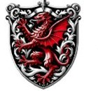

---
tags:
  - erb
  - rod
  - elf
  - vzneseny
Typ: Vznešení elfové
Lokace: Cormyr
Specializace: Magické schopnosti, arkanická umění
---

# Rod Cormeril

Rod vznešených elfů z Cormyru. Jsou známý svými silnými magickými schopnostmi a hlubokými znalostmi arkanických umění.

---

*Zdroj: [[Erby]]*
