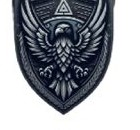

---
tags:
  - erb
  - rod
  - trpaslik
  - horsky
Typ: Horští trpaslíci
Specializace: Těžba, zpracování vzácných kovů, kovářství
---

# Rod Guldar

Rod horských trpaslíků známí svými dovednostmi v těžbě a zpracování vzácných kovů. Trpaslíci z rodu Guldar jsou mistři kovářství a jejich výrobky jsou vysoce ceněny pro jejich kvalitu a krásu.

---

*Zdroj: [[Erby]]*
