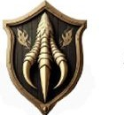

---
tags:
  - erb
  - rod
  - elf
  - morsky
Typ: Mořští elfové
Specializace: Exotické zboží z dna moře, ochrana lodí
Organizace: Lovci Krakenů
---

# Rod Scemm

Rod mořských elfů. Dovážejí exotické zboží které získávají ze dna moře. Říká se že mají alianci s podmořskými. Zakladatelé organizace Lovci Krakenů. Nechávají se najímat za ochranu obchodních lodí před piráty, divokými kmeny a mořskými monstry.

---

*Zdroj: [[Erby]]*
