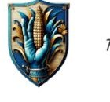

---
tags:
  - erb
  - rod
  - lidsky
Typ: Lidský rod
Specializace: Karavany, farmářství, chov dobytka
---

# Rod Thorsar

Tento rod je známý tím že má velké množství karavan které obchodují celém regionu. Mají také velké množství farem na kterých pěstují různé plodiny, chovají dobytek a zuby které jsou signifikantní pro jejich karavany.

---

*Zdroj: [[Erby]]*
